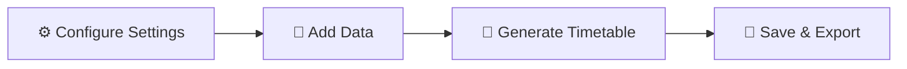

<div align="center">

# 📚 Curriflex

### *Intelligent Timetable Management System*

**Automatically generate 100% conflict-free academic schedules with minimal effort**

[](https://reactjs.org/)
[](https://www.typescriptlang.org/)
[](https://firebase.google.com/)
[](https://tailwindcss.com/)


[Features](#-features) • [Demo](#-demo) • [Installation](#-installation) • [Usage](#-usage) • [Tech Stack](#-tech-stack)

</div>

---

## 🌟 Why Curriflex?

> **Stop wasting hours on manual timetable creation!** Curriflex uses intelligent algorithms to generate perfect schedules in seconds, eliminating conflicts and optimizing resource allocation.

<div align="center">

| 🎯 **Smart** | 🚀 **Fast** | 💎 **Beautiful** | 🔧 **Flexible** |
|:---:|:---:|:---:|:---:|
| AI-powered scheduling | Generate in seconds | Modern glass UI | Fully customizable |

</div>

---

## ✨ Features

### 🎯 **Core Capabilities**

<table>
<tr>
<td width="50%">

#### 🤖 Smart Auto-Generation
- ✅ **Conflict-free scheduling** using advanced algorithms
- ✅ **Unique daily schedules** with prime number distribution
- ✅ **Real-time conflict detection**
- ✅ **Optimal resource allocation**

</td>
<td width="50%">

#### 📊 Complete Management
- ✅ **Department & Year organization**
- ✅ **Faculty workload tracking**
- ✅ **Subject management** (Theory/Lab/Practical)
- ✅ **Room & laboratory allocation**

</td>
</tr>
</table>

### 📄 **Professional Exports**

| Format | Features |
|--------|----------|
| 📕 **PDF** | Single-page landscape • Orange theme • Logo integration • Dark borders |
| 📗 **Excel** | Professional formatting • Multi-line cells • Orange headers • Auto-width columns |

### 🎨 **Modern UI/UX**

```
✨ Liquid Glass Effects     🌓 Animated Theme Toggle
🎭 Smooth Animations        🎨 Professional Dark Theme
📱 Fully Responsive         ✍️ Poppins Typography
```

---

## 🚀 Quick Start

### Prerequisites

```bash
Node.js 18+  •  npm/yarn  •  Firebase Account
```

### Installation

```bash
# 1️⃣ Clone the repository
git clone https://github.com/Ashitosh2004/Curriflex.git
cd curriflex

# 2️⃣ Install dependencies
npm install

# 3️⃣ Configure Firebase
# Create .env.local with your Firebase credentials
cp .env.example .env.local

# 4️⃣ Start development server
npm run dev

# 5️⃣ Open browser
# Navigate to http://localhost:5173
```

### 🔥 Firebase Configuration

Create `.env.local` in the root directory:

```env
VITE_FIREBASE_API_KEY=your_api_key
VITE_FIREBASE_AUTH_DOMAIN=your_auth_domain
VITE_FIREBASE_PROJECT_ID=your_project_id
VITE_FIREBASE_STORAGE_BUCKET=your_storage_bucket
VITE_FIREBASE_MESSAGING_SENDER_ID=your_sender_id
VITE_FIREBASE_APP_ID=your_app_id
```

---

## 📖 Usage Guide

### 🎬 Getting Started in 3 Steps



<details>
<summary><b>📋 Step 1: Initial Setup</b></summary>

1. Navigate to **Settings** page
2. Select institution type (School/College/University)
3. Configure time slots and working days
4. Set break and lunch periods

</details>

<details>
<summary><b>📝 Step 2: Add Your Data</b></summary>

| Order | Page | What to Add |
|-------|------|-------------|
| 1️⃣ | Departments | Add departments with names and years |
| 2️⃣ | Faculty | Add faculty members |
| 3️⃣ | Subjects | Add subjects with codes and hours |
| 4️⃣ | Rooms | Add classrooms and labs |
| 5️⃣ | Subject Allocation | Assign subjects to faculty |

</details>

<details>
<summary><b>🎯 Step 3: Generate Timetable</b></summary>

1. Go to **Timetable** page
2. Select department and year
3. Click **"Generate Timetable"**
4. Review the generated schedule
5. **Save** or **Export** (PDF/Excel)

</details>

---

## 🛠️ Tech Stack

<div align="center">

### Frontend


### Backend & Database


### Libraries


</div>

---

## 📁 Project Structure

```
curriflex/
├── 📂 public/              # Static assets
│   ├── 🖼️ logo.png         # App logo
│   └── 🤖 robots.txt       # SEO config
├── 📂 src/
│   ├── 📂 components/      # Reusable components
│   │   ├── 📂 ui/         # UI library
│   │   ├── Layout.tsx     # Main layout
│   │   └── ThemeToggle.tsx # Theme switcher
│   ├── 📂 contexts/       # React contexts
│   ├── 📂 lib/            # Utilities
│   ├── 📂 pages/          # Page components
│   ├── 📂 utils/          # Helper functions
│   │   └── timetableGenerator.ts # Core algorithm
│   └── 📂 types/          # TypeScript types
├── ⚙️ vite.config.ts       # Vite config
├── 🎨 tailwind.config.ts   # Tailwind config
└── 📦 package.json         # Dependencies
```

---

## 🎨 Design System

### Color Palette

<table>
<tr>
<td align="center" width="50%">

**☀️ Light Mode**
```
Primary: #FF8C00 (Orange)
Background: #FFFFFF (White)
Text: #1A1A1A (Dark Gray)
```

</td>
<td align="center" width="50%">

**🌙 Dark Mode**
```
Primary: #3B82F6 (Blue)
Background: #1A202E (Slate)
Accent: #06B6D4 (Cyan)
```

</td>
</tr>
</table>

### Typography

```
Font Family: Poppins
Weights: 300, 400, 500, 600, 700, 800
```

---

## 🔧 Configuration

### Time Slots

Configure in **Time Config** page:
- ⏰ Start and end times
- ☕ Break periods
- 🍽️ Lunch periods
- 📅 Working days

### Firebase Security Rules

```javascript
rules_version = '2';
service cloud.firestore {
  match /databases/{database}/documents {
    match /{document=**} {
      allow read, write: if true;
    }
  }
}
```

---

## 📊 Database Schema

| Collection | Description |
|------------|-------------|
| 🏢 `departments` | Department information |
| 👨‍🏫 `faculty` | Faculty members |
| 📚 `subjects` | Subject definitions |
| 🚪 `rooms` | Room/lab information |
| 👨‍🎓 `students` | Student records |
| 🔗 `subjectAllocations` | Faculty-subject assignments |
| ⏱️ `timeConfig` | Time slot configuration |
| 📅 `timetables` | Generated timetables |

---

## 🤝 Contributing

We welcome contributions! Here's how:

```bash
# 1. Fork the repository
# 2. Create your feature branch
git checkout -b feature/AmazingFeature

# 3. Commit your changes
git commit -m 'Add some AmazingFeature'

# 4. Push to the branch
git push origin feature/AmazingFeature

# 5. Open a Pull Request
```

---

## 📝 License

This project is licensed under the **MIT License** - see the [LICENSE](LICENSE) file for details.

---

## 🌟 Acknowledgments

<div align="center">

**Built with amazing open-source projects**

[React](https://reactjs.org/) • [TypeScript](https://www.typescriptlang.org/) • [Firebase](https://firebase.google.com/) • [Tailwind CSS](https://tailwindcss.com/) • [Radix UI](https://www.radix-ui.com/) • [Lucide Icons](https://lucide.dev/)

</div>

---

## 📧 Support & Contact

<div align="center">

**Need help?** We're here for you!

📧 Email: support@curriflex.com  
🐛 Issues: [GitHub Issues](https://github.com/Ashitosh2004/curriflex/issues)  
💬 Discussions: [GitHub Discussions](https://github.com/Ashitosh2004/curriflex/discussions)

</div>

---

## 🔄 Version History

### 🎉 v1.0.0 - Current Release

<details>
<summary><b>✨ What's New</b></summary>

- ✅ Smart timetable generation with unique daily schedules
- ✅ Professional PDF and Excel exports with logo
- ✅ Modern UI with liquid glass effects
- ✅ Animated sun/moon theme toggle
- ✅ Professional slate-blue dark theme
- ✅ Complete CRUD operations for all entities
- ✅ Firebase Firestore integration
- ✅ Fully responsive design
- ✅ Poppins typography
- ✅ Blue/cyan color scheme for dark mode

</details>

---

<div align="center">

### 💝 Made with Love for Educational Institutions

**⭐ Star this repo if you find it helpful!**

[](https://github.com/Ashitosh2004/curriflex/stargazers)
[](https://github.com/Ashitosh2004/curriflex/network/members)

---

**© 2026 Curriflex Team. All rights reserved.**

[⬆ Back to Top](#-curriflex)

</div>
